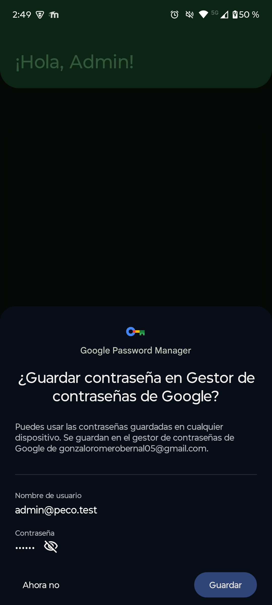
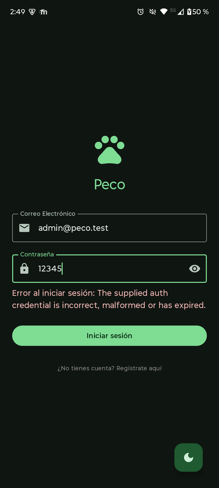
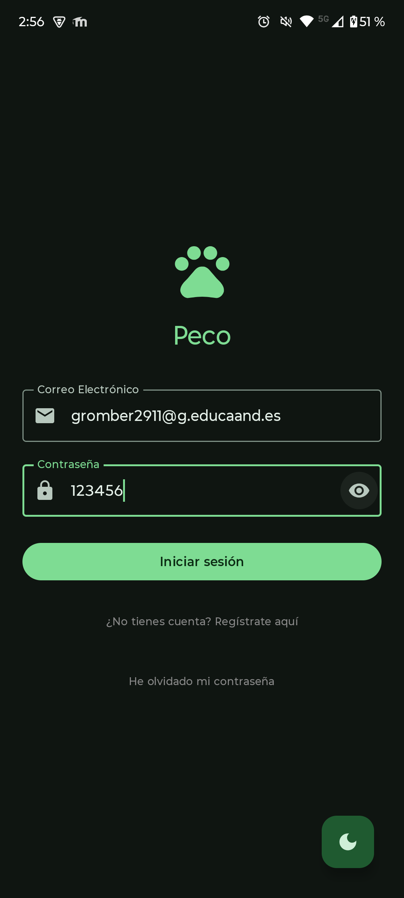

# Pruebas Unitarias

## 1. Objetivo

Este documento recoge las pruebas realizadas en **PECO** para validar el correcto funcionamiento de la aplicación (flujos principales, control de roles y generación de informes), incluyendo pruebas **manuales**, **funcionales**, **de regresión** y una base de **pruebas unitarias**.

---

## 2. Entorno de pruebas

Las pruebas de la aplicación se han realizado en **dos entornos distintos**, combinando un **dispositivo físico real** y un **emulador**, con el objetivo de validar el correcto funcionamiento tanto en hardware real como en un entorno controlado de desarrollo.

---

### 2.1 Dispositivo físico

* **Dispositivo:** Motorola G55 5G
* **Sistema operativo:** Android 14
* **Build:** Debug / Release
* **Backend:** Firebase Auth + Firestore
* **Conectividad:** Wi-Fi y datos móviles
* **Fecha:** (dd/mm/aaaa)
* **Versión de la app:** v1.0.0

Este entorno permite comprobar el comportamiento de la aplicación en un dispositivo real, evaluando el rendimiento, la fluidez de la interfaz, la navegación y la interacción del usuario en condiciones de uso habituales.

---

### 2.2 Emulador Android Studio

* **Dispositivo emulado:** Medium Phone
* **API:** Android API 34
* **Sistema operativo:** Android 14
* **Build:** Debug
* **Backend:** Firebase Auth + Firestore
* **Conectividad:** Emulada (Wi-Fi)
* **Fecha:** (dd/mm/aaaa)
* **Versión de la app:** v1.0.0

El uso del emulador permite reproducir escenarios de prueba controlados, facilitar la depuración y validar el comportamiento de la aplicación ante distintos estados sin depender de hardware físico. Sin embargo posee algunas limitaciones.

---

## 3. Datos de prueba

### 3.1 Cuentas

* **Usuario normal:** [user@peco.test](mailto:user@peco.test)
* **Voluntario:** [voluntario@peco.test](mailto:voluntario@peco.test)
* **Admin:** [admin@peco.test](mailto:admin@peco.test)

### 3.2 Animales

Se han creado al menos 5 animales con combinaciones:

* 2 “Disponibles”
* 2 “Pendientes”
* 1 “Adoptado”
* Mínimo 2 especies distintas (perro/gato u otras)

---

## 4. Pruebas manuales y funcionales

> Formato: **ID** · **Caso** · **Pasos** · **Resultado esperado** · **Resultado** · **Notas/Capturas**

### 4.1 Autenticación (Login/Registro)

**PR-LOGIN-01 — Login correcto**

* Pasos:

  1. Abrir app
  2. Introducir email/contraseña válidos
  3. Pulsar “Iniciar sesión”
* Resultado esperado:

  * Se inicia sesión y navega a **Home**
* Resultado: ✅
* Notas: Se ha iniciado sesión con las tres cuentas en ambos entornos de prueba y se ha comprobado perfectamente que se puede iniciar sesión sin error.

**PR-LOGIN-02 — Login incorrecto**

* Pasos:

  1. Email válido + contraseña incorrecta
  2. Pulsar “Iniciar sesión”
* Resultado esperado:

  * Se muestra error (sin crashear) y permanece en pantalla
* Resultado: ✅
* Notas:

**PR-REG-01 — Registro correcto**

* Pasos:

  1. Ir a registro
  2. Completar formulario
  3. Confirmar registro
* Resultado esperado:

  * Cuenta creada, sesión iniciada o retorno a login (según flujo)
* Resultado: ✅
* Notas:

---

### 4.2 Navegación principal

**PR-NAV-01 — Navegación Home → Listado**

* Pasos: abrir Home, entrar a listado
* Esperado: muestra lista sin errores
* Resultado: ✅

**PR-NAV-02 — Listado → Detalle**

* Pasos: pulsar un animal
* Esperado: abre detalle con datos correctos
* Resultado: ✅

**PR-NAV-03 — Back**

* Pasos: ir a detalle y volver atrás
* Esperado: vuelve al listado conservando estado razonable
* Resultado: ✅

---

### 4.3 Favoritos / Likes

**PR-FAV-01 — Añadir a favoritos**

* Pasos:

  1. En listado / swipe, dar like a un animal
  2. Ir a pantalla de favoritos
* Esperado:

  * El animal aparece en favoritos
* Resultado: ✅

**PR-FAV-02 — Favoritos vacíos**

* Pasos: usuario sin likes entra a favoritos
* Esperado: texto “No tienes favoritos”
* Resultado: ✅

---

### 4.4 Rol voluntario: “Mis animales” + FAB + Filtro

**PR-VOL-01 — Pantalla Mis animales activa filtro**

* Pasos:

  1. Iniciar sesión como voluntario
  2. Entrar a “Mis animales”
* Esperado:

  * Se muestran solo animales con `volunteerId == uid`
* Resultado: ✅

**PR-VOL-02 — FAB visible solo en Mis animales**

* Pasos:

  1. Abrir listado general
  2. Abrir “Mis animales”
* Esperado:

  * En listado general NO aparece FAB
  * En “Mis animales” SÍ aparece FAB “Añadir animal”
* Resultado: ✅

---

### 4.5 Borrado de animales

**PR-DEL-01 — Confirmación antes de borrar**

* Pasos:

  1. En “Mis animales”, pulsar borrar
* Esperado:

  * Aparece diálogo de confirmación
* Resultado: ✅

**PR-DEL-02 — Cancelar borrado**

* Pasos:

  1. Abrir diálogo
  2. Pulsar “Cancelar”
* Esperado:

  * No se borra el animal
* Resultado: ✅

**PR-DEL-03 — Confirmar borrado**

* Pasos:

  1. Abrir diálogo
  2. Pulsar “Eliminar”
* Esperado:

  * Animal eliminado en Firestore y desaparece de la lista
  * Se muestra feedback (snackbar o mensaje)
* Resultado: ✅

---

### 4.6 Informes PDF + filtros

**PR-PDF-01 — Generar PDF con datos**

* Pasos:

  1. Ir a Informes (Admin/Voluntario según tu app)
  2. Pulsar “Generar informe (PDF)”
* Esperado:

  * Se genera archivo PDF sin crashear
  * Se puede abrir/compartir
* Resultado: ✅

**PR-PDF-02 — PDF sin datos**

* Pasos: generar PDF con lista vacía (o en entorno de prueba)
* Esperado:

  * PDF contiene mensaje “No hay datos”
* Resultado: ✅

**PR-PDF-03 — Filtros del informe**

* Pasos:

  1. Abrir “Filtros del informe”
  2. Activar un filtro (ej. “Solo adoptados”)
  3. Generar PDF
* Esperado:

  * El PDF solo incluye animales que cumplen el filtro
* Resultado: ✅

---

## 5. Pruebas de regresión

Se repiten los flujos críticos tras añadir funcionalidades:

* Login correcto (PR-LOGIN-01)
* Navegación Home → Listado → Detalle (PR-NAV-01/02)
* Mis animales + FAB (PR-VOL-01/02)
* Borrado con confirmación (PR-DEL-01/03)
* PDF (PR-PDF-01)

Resultados globales: ✅

---

## 6. Pruebas unitarias (RA8)

Se implementan pruebas unitarias centradas en **ViewModels y lógica**, aislando Firebase mediante repositorios simulados (mocks).
Las pruebas unitarias se ubican en el directorio src/test, siguiendo la misma estructura de paquetes que el código principal. Esto permite mantener coherencia, facilitar el mantenimiento y aislar la lógica de negocio del entorno Android y de servicios externos como Firebase mediante el uso de repositorios simulados.

### 6.1 Herramientas

* JUnit
* Coroutines Test
* MockK
* Turbine (Flow)

### 6.2 Casos unitarios propuestos

**UT-ANIM-01 — Filtrado favoritos**

* Dado una lista de animales y un set `likedIds`
* Cuando `filter == false`
* Entonces devuelve solo los animales cuyo `uid` está en `likedIds`

**UT-ANIM-02 — Filtrado mis animales**

* Dado `uid` voluntario y lista de animales con `volunteerId`
* Cuando `filter == true`
* Entonces devuelve solo los animales con `volunteerId == uid`

**UT-ANIM-03 — deleteAnimal llama al repositorio**

* Dado un repositorio mock
* Cuando se llama `deleteAnimal(id)`
* Entonces se invoca `repository.deleteAnimal(id)`

---

## 7. Incidencias conocidas

### Limitación de imágenes por Firebase Storage en este contexto
Durante el desarrollo de PECO se planteó incluir imágenes reales para cada animal (foto de perfil) mediante subida y almacenamiento en la nube. La opción natural dentro del ecosistema Firebase es Firebase Storage, ya que se integra con Firebase Auth y permite servir recursos multimedia asociados a documentos de Firestore.

Sin embargo, en el contexto de este proyecto se detectaron limitaciones que impidieron implementar esta funcionalidad de forma estable y adecuada para el proyecto:

- Restricciones de configuración y seguridad: Firebase Storage requiere definir reglas de acceso estrictas para evitar exposición pública de archivos. Ajustar correctamente permisos por roles (usuario/voluntario/admin) y por propietario del recurso implica una configuración adicional que debe ser validada en profundidad.

- Problemas operativos en el entorno de pruebas: durante la subida de imágenes se produjeron errores de sesión de subida y fallos intermitentes, especialmente en dispositivos/emuladores dependiendo de la red. Esto afectaba a la estabilidad de la app y a la experiencia de usuario.

- Complejidad añadida frente al alcance del proyecto: para garantizar una implementación completa se necesitaría, además del upload, gestionar compresión, formatos, estados de carga, recuperación ante fallos, cache local y borrado sincronizado (Firestore + Storage), lo cual aumentaba significativamente el alcance técnico sin aportar valor crítico a los objetivos principales evaluados.

- Por estos motivos, y priorizando la estabilidad, la coherencia del sistema y el cumplimiento del resto de requisitos (roles, navegación, filtros e informes PDF), se decidió dejar la carga de imágenes como mejora futura documentada. Actualmente el campo photo se mantiene en el modelo para permitir su integración posterior sin afectar a la arquitectura del proyecto.

---

## 8. Evidencias

* Capturas: 

 
 
 

---

## 9. Conclusión

Las pruebas realizadas validan los flujos principales de PECO, incluyendo autenticación, navegación, gestión de animales por rol, borrado seguro y generación de informes PDF. Además, se plantea y/o implementa una base de pruebas unitarias sobre la lógica de presentación para reforzar la calidad del proyecto.

---